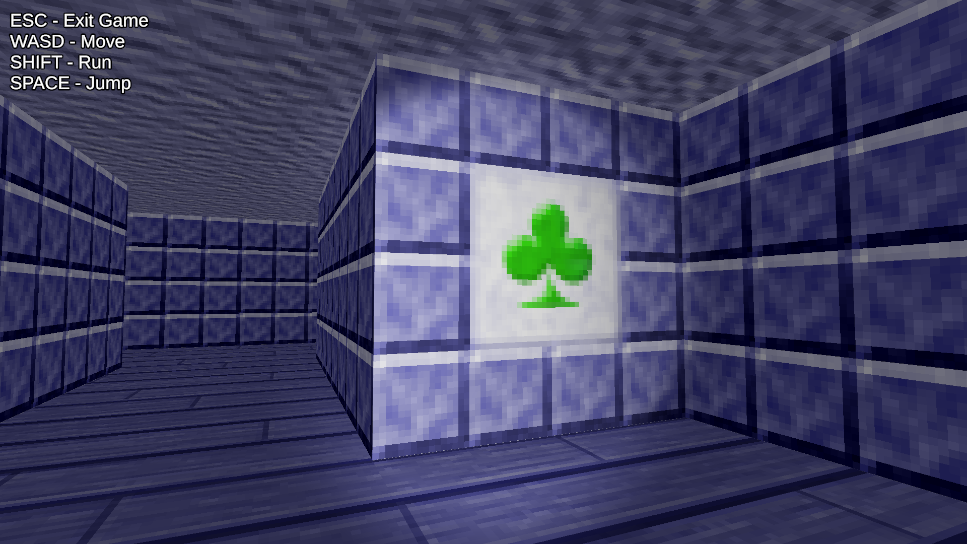
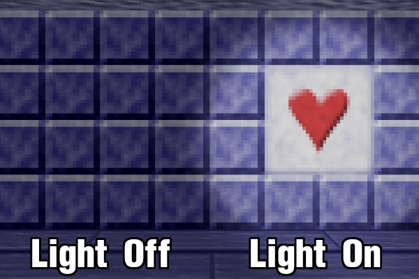
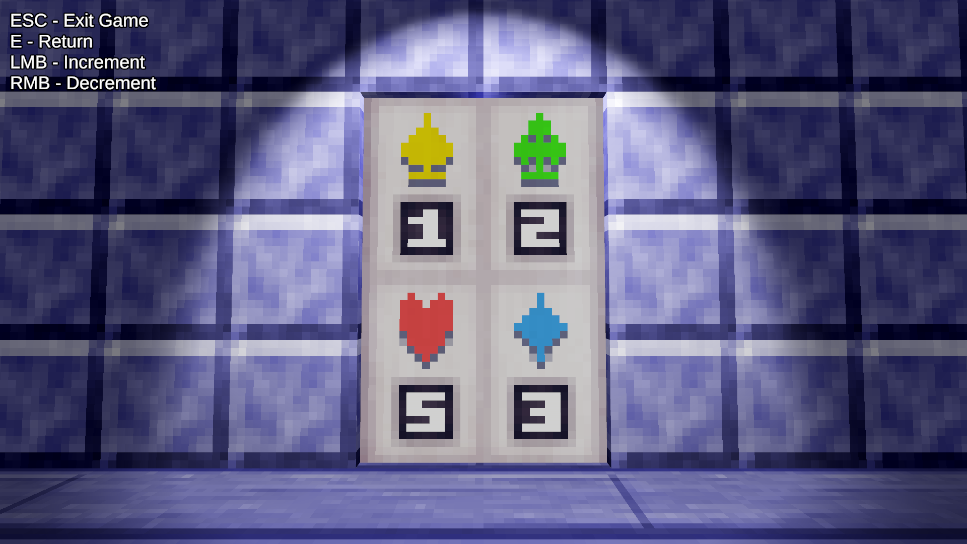

# Unity Concept - Flashlight Puzzle

*Created using Unity version 2022.3.18f1*

## Overview

This is a simple game project where you use a flashlight to uncover hidden symbols on the walls.

This project is mainly intended to showcase a custom Universal Render Pipeline shader which uses separate textures for both the lit and unlit areas of a mesh. This shader is mostly designed for creating rather unique lighting effects. However, as demonstrated in this project, the shader can also be used as part of a gameplay mechanic.

In the above image, the wall on the left is comprised of blue square tiles, and the wall on the right has those same tiles surrounding a larger tile with a red heart in the center. However, both walls are actually using the same material! When a light source is cast on the wall's surface the "secret" lit texture is revealed. 

## Game Objective

The goal of the game is to figure out the correct number combination of this door to unlock it and grab the treasure hidden within.

This is where these "secret" walls come into play. There are four types of secret walls, each one corresponding to the shape and colors seen on the door. A random number of secret walls have been placed throughout the room. Using your flashlight, you will need to figure out how many of each type of secret wall are present and edit the door number combination accordingly.

## Controls

### Character Movement
* WASD - Move
* Shift (hold) - Run
* Space - Jump
* Left Mouse Button - Interact with object
* E - Edit door lock combination (Only when nearby and facing the door) 

### Door Lock Combination Editing
* Left Mouse Button - Increment selected number (or loop to the lowest number)
* Right Mouse Button - Decrement selected number (or loop to the highest number)
* E - Quit editing door lock combination

### General
* Escape - Exit game
* F1 - Enable/disable "cheat sheet," revealing the number of secret walls present

## Future Updates
* Add sound effects
* Escape pauses the game instead of quitting it
* A pause menu with buttons to adjust settings and to quit the game
* Control settings to change key binds, invert mouse axes, and adjust mouse sensitivity
* Display settings to change the game resolutions and display mode (window, fullscreen)
* Ability to toggle on/off camera view bobbing
* Graphical improvements to the win screen

## Acknowledgements
URP shader code, as well as some elements within Shader Graphs, were created with the help of [video](https://www.youtube.com/@NedMakesGames) and [text](https://nedmakesgames.medium.com/) tutorials from Ned Atton of Ned Makes Games.

A quadratic ease in/out function used for the gem animation is based on code from Andrey Sitnik and Ivan Solovev at [easings.net](https://easings.net/#easeInOutQuad).
